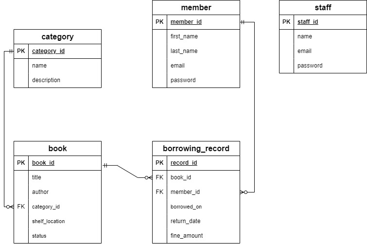
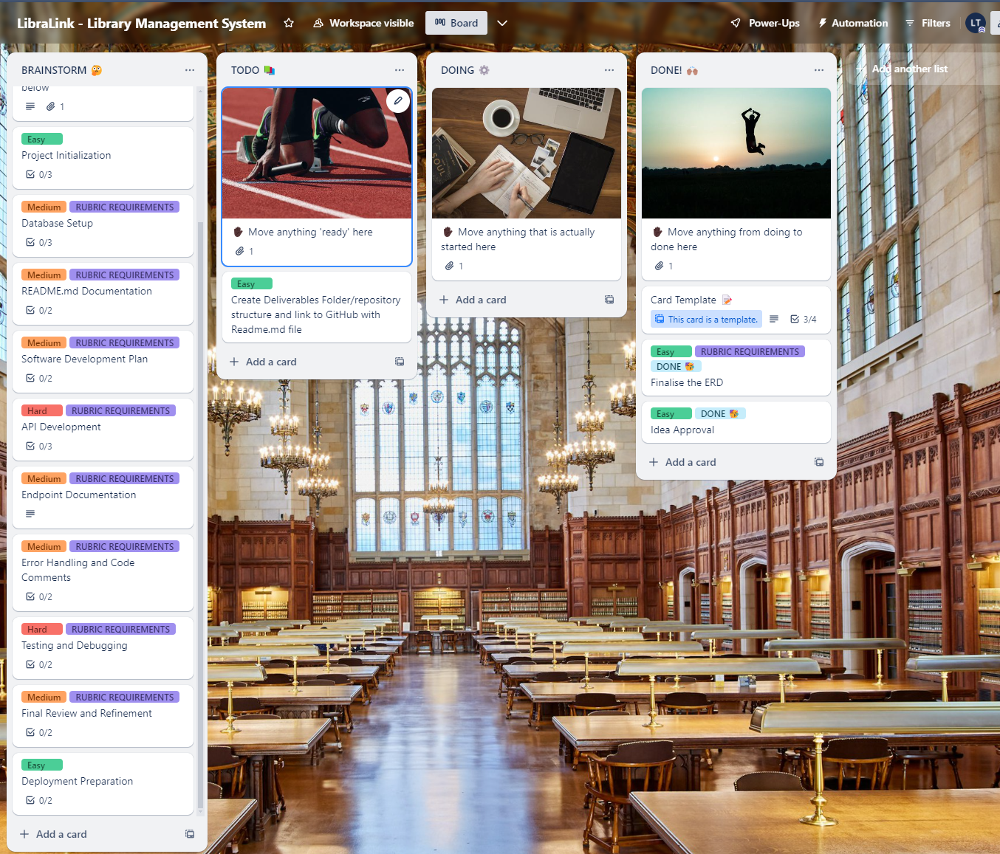
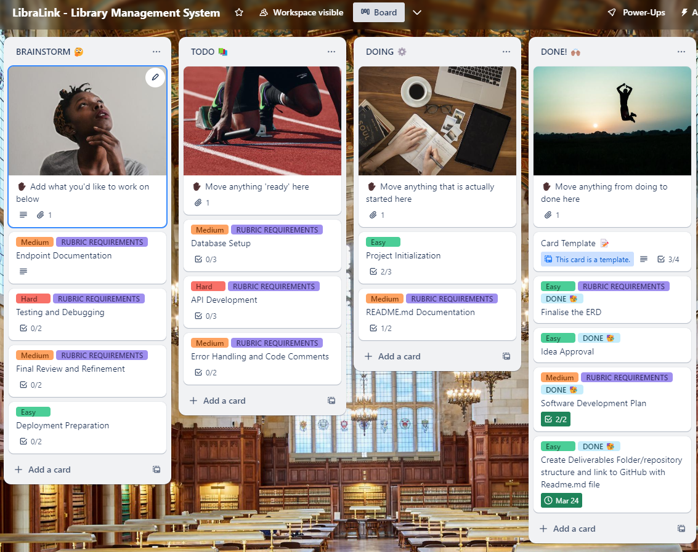
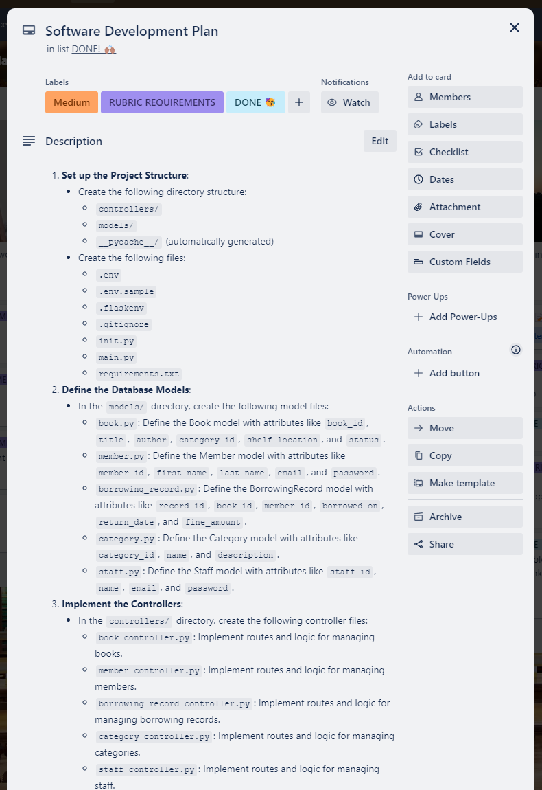
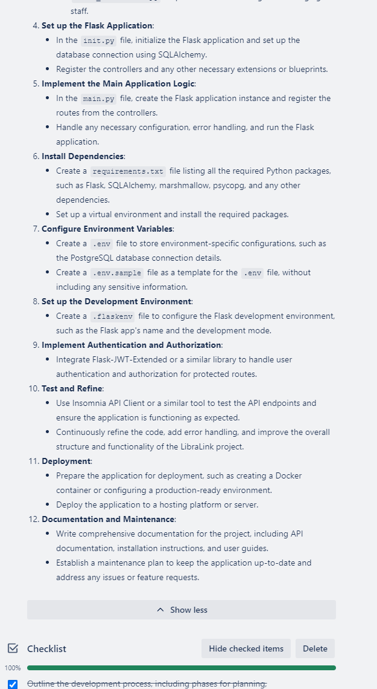

# T2A2 - API Webserver Project
## LibraLink - Library Management System

**LibraLink** is a comprehensive library management system designed to streamline the administration of library resources.

[Github Link]() | [Trello Link]()

## Table of Contents:

- Installation
- R1: Identification of the problem you are trying to solve by building this particular app.
- R2: Why is it a problem that needs solving?
- R3: Why have you chosen this database system? What are the drawbacks compared to others?
- R4: Identify and discuss the key functionalities and benefits of an ORM.
- R5: Document all endpoints for your API.
- R6: An ERD for your app.
- R7: Detail any third-party services that your app will use.
- R8: Describe your project’s models in terms of the relationships they have with each other.
- R9: Discuss the database relations to be implemented in your application.
- R10: Describe the way tasks are allocated and tracked in your project.

## Installation Guide for LibraLink API:
Step-by-step guide on how to install and run the application.

The steps below assume you are running on a macOS or Linux-based operating system.

1. **Clone the Repository**

- Clone the LibraLink API repository from the provided GitHub link to your local machine.

- Open the `src` folder in your terminal of choice.

2. **Set up a Virtual Environment**

- Run `python3 -m venv .venv` to create a new virtual environment.

- Activate the virtual environment using source `.venv/bin/activate`.

3. **Install Dependencies**

- Run `pip3 install -r requirements.txt` to install the required Python packages and modules.

4. **Set up the Database**

- Create a new PostgreSQL database and user for the LibraLink API.

- Create a `.env` file in the `src` folder based on the provided `.env.sample` file.

- Update the `.env` file with your database URI and any other required environment variables, such as the `SECRET_KEY`.

5. **Initialize the Database**

- Run `flask db init` to initialize the database and create the required tables.

- Run `flask db upgrade` to apply any pending database migrations.
(Optional) Run `flask db seed` to populate the database with default seed data.

6. **Start the API Server**

- Run `flask run` to start the Flask server.

- The API will be available at `http://localhost:8080`.

7. **Import API Endpoints (Optional)**

- Import the provided `Insomnia_Routes.json` file into the Insomnia API client.

- This will give you a pre-configured set of all the available API endpoints.

8. **Verify the Installation**

- Test the API endpoints using Insomnia or your preferred API client.

- Ensure that you can perform CRUD operations on the various entities (books, members, borrowing records, categories, and staff).

By following these steps, you should have a fully functional LibraLink API server up and running on your local machine. Remember to update the .env file with the correct database credentials and any other required environment variables.

### R1 - Identification of the problem you are trying to solve by building this particular app.

LibraLink is designed to address the inefficiencies of traditional library management systems.

The LibraLink Library Management System is being developed to solve the problem of effectively managing the operations of a library. Specifically, the key problems this app aims to address are:
- **Efficient Book Management:** Providing a centralized system to track and manage the library's book inventory, including details like book titles, authors, categories, and availability status.
- **Streamlined Borrowing Process:** Enabling members to borrow and return books seamlessly, while also tracking the borrowing history and any associated fines.
- **Improved Data Organization:** Organizing the library's data, such as member information, book categories, and borrowing records, in a structured and easily accessible manner.
- **Enhanced Reporting and Analytics:** Generating reports and analytics to help the library staff make informed decisions about book acquisitions, member engagement, and overall operational efficiency.

### R2 - Why is it a problem that needs solving?

The problems mentioned above are common challenges faced by many libraries, especially as their collections and member base grow. Without a centralized and well-organized library management system, libraries can struggle with the following issues:

- Difficulty in tracking book inventory and availability.
- Inefficient borrowing and return processes, leading to delays and confusion.
- Fragmented and disorganized data, making it hard to retrieve information and generate meaningful reports.
- Lack of visibility into library operations, hindering data-driven decision-making.

By addressing these problems, the LibraLink Library Management System aims to improve the overall efficiency, user experience, and data-driven decision-making capabilities of the library.

### R3 - Why have you chosen this database system. What are the drawbacks compared to others?

The LibraLink Library Management System will use a relational database, specifically PostgreSQL, to store and manage the data. The choice of PostgreSQL is based on the following key factors:

1. **Scalability:** PostgreSQL is highly scalable and can handle large amounts of data and high traffic loads, making it suitable for a growing library management system.

2. **Data Integrity:** PostgreSQL provides strong data integrity features, such as ACID (Atomicity, Consistency, Isolation, Durability) compliance, which ensures the reliability and consistency of the data.

3. **Extensibility:** PostgreSQL has a rich ecosystem of extensions and plugins, allowing for the addition of specialized features and functionalities as the project evolves.

4. **SQL Compliance:** PostgreSQL closely adheres to the SQL standard, making it easier to work with and integrate with other applications and tools.

5. **Community and Support:** PostgreSQL has a large and active community of developers and users, providing extensive documentation, resources, and support.

Compared to other database systems, such as MySQL or SQLite, the potential drawbacks of using PostgreSQL for the LibraLink project may include:

1. **Complexity:** PostgreSQL is a more feature-rich and complex database system, which may require a steeper learning curve for some developers.

2. **Performance:** While PostgreSQL is highly scalable, for certain workloads or use cases, other database systems like MySQL may offer slightly better performance, especially for read-heavy applications.

3. **Cost:** Depending on the scale and requirements of the project, the cost of running and maintaining a PostgreSQL database may be higher than some other open-source or cloud-based database options.

However, the benefits of using PostgreSQL, such as its data integrity, scalability, and strong community support, outweigh the potential drawbacks for the LibraLink Library Management System. The project team believes that PostgreSQL is the most suitable choice to meet the long-term needs and requirements of the library's data management needs.

### R4 - Identify and discuss the key functionalities and benefits of an ORM

### Key Functionalities of SQLAlchemy ORM

1. **Database Abstraction**

SQLAlchemy provides a high-level abstraction over the underlying database, allowing developers to interact with the database using Python objects and classes rather than writing raw SQL queries. This abstraction simplifies database interactions and makes the code more readable and maintainable.

2. **Object-Relational Mapping (ORM)**

SQLAlchemy's ORM layer maps Python classes to database tables, allowing developers to work with data in an object-oriented way. This includes features like automatic object persistence, lazy loading of related objects, and support for complex relationships between objects.

3. **SQL Expression Language**

SQLAlchemy's SQL Expression Language provides a Pythonic way to construct SQL queries, allowing developers to write complex queries using Python syntax rather than raw SQL. This makes the code more readable and maintainable.

4. **Database Agnostic**

SQLAlchemy supports a wide range of database engines, including SQLite, PostgreSQL, MySQL, Oracle, and more. This allows developers to write database-agnostic code that can be easily ported to different databases.

5. **Database Schema Management**

SQLAlchemy provides tools like Alembic for managing database schema changes, allowing developers to automatically synchronize the database schema with their application code.

6. **Data Type Conversion**

SQLAlchemy automatically handles the conversion between Python data types and database data types, simplifying the process of working with data in the application.

7. **Caching and Lazy Loading**

SQLAlchemy's ORM provides features like caching and lazy loading, which can improve the performance of database-heavy applications by reducing the number of database queries.

### Key Benefits of SQLAlchemy ORM

1. **Increased Productivity**

By abstracting away the complexity of database interactions, SQLAlchemy allows developers to focus on writing business logic rather than dealing with low-level database concerns. This can significantly increase developer productivity.

2. **Improved Code Maintainability**

SQLAlchemy's object-oriented approach and database-agnostic design make the codebase more readable and easier to maintain, especially for large-scale applications.

3. **Enhanced Performance**

SQLAlchemy's advanced features, such as caching and lazy loading, can help improve the performance of database-heavy applications by reducing the number of database queries.

4. **Reduced Risk of SQL Injection**

SQLAlchemy's use of parameterized queries helps protect against SQL injection attacks, improving the overall security of the application.

5. **Easier Database Schema Management**

SQLAlchemy's schema management tools, like Alembic, make it easier to keep the database schema in sync with the application code, reducing the risk of errors and making it easier to deploy changes.

6. **Increased Flexibility**

SQLAlchemy's database-agnostic design and support for a wide range of database engines make it easier to switch between different databases or to support multiple databases within the same application.

In summary, the key functionalities and benefits of SQLAlchemy ORM make it a powerful and versatile tool for building database-driven applications, particularly in the context of a Flask-based Library Management System using PostgreSQL.

### R5 - Document all endpoints for your API

The API will have endpoints for books, members, borrowing records, categories, and staff, each supporting GET, POST, PUT, and DELETE methods as appropriate for full CRUD functionality.

The API will include endpoints such as:

/books (GET, POST, PUT, DELETE)

/members (GET, POST, PUT, DELETE)

/borrowing_records (GET, POST, PUT, DELETE)

/categories (GET, POST, PUT, DELETE)

/staff (GET, POST, PUT, DELETE)

### R6 - An ERD for your app

The ERD will illustrate the relationships between books, members, borrowing records, categories, and staff, showing how these entities interact within the library system.

### R7 - Detail any third party services that your app will use

1. **Development Environment & Tools:**

- **Python:** The programming language for writing your application.
- **Flask:** A micro web framework for building web applications.
- **Visual Studio Code (VS Code):** A code editor for writing and debugging code.
- **Insomnia API Client app:** A tool for testing API endpoints.
- **PostgreSQL:** A relational database system for storing and managing data.
- **GitHub Copilot:** An AI pair programmer to assist in writing code.

2. **Project Management:**

- **Trello:** A web-based tool for organizing tasks and collaboration.

3. **Python Libraries & Extensions:**

- **SQLAlchemy:** An ORM library for database interactions.
- **Marshmallow:** A library for object serialization/deserialization.
- **psycopg2:** A PostgreSQL adapter for Python.
- **Flask-SQLAlchemy:** Adds SQLAlchemy support to Flask.
- **flask-marshmallow:** Integrates Marshmallow with Flask.
- **Flask-Bcrypt:** Provides bcrypt hashing utilities for Flask.
- **Flask-JWT-Extended:** Adds JWT support for authentication in Flask.
- **python-dotenv:** Loads environment variables from a .env file.
- **bcrypt:** A library for hashing passwords securely.
- **PyJWT:** A library to encode and decode JWTs for secure authentication.

### R8 - Describe your projects models in terms of the relationships they have with each other

Books are associated with categories and borrowing records. Members are linked to borrowing records. Staff are connected to borrowing records and can update book statuses.

The models in LibraLink reflect real-world library entities and their interactions:

    Books are categorized and involved in borrowing transactions.
    Members engage in borrowing activities.
    Staff oversee borrowing records and manage book statuses.

### R9 - Discuss the database relations to be implemented in your application

The database will implement one-to-many relationships between categories and books, books and borrowing records, and members and borrowing records. Staff will manage borrowing records.

The database will implement relations such as:

    One-to-Many between Categories and Books.
    One-to-Many between Books and Borrowing Records.
    One-to-Many between Members and Borrowing Records.

### R10 - Describe the way tasks are allocated and tracked in your project

I use Trello as my project management tool/software to manage my software development plan.

First, I created a simple Software Development Plan (SDP). This was only for the purpose of giving a high-level view of the project as a whole. The estimated time was set at the beginning to be 11 hours, which is highly unlikely but provides a rough idea of how I expect myself to handle this type of project in the future once I become experienced. It also shows a bigger picture and the idea of how I should spend most of my time on the project:

- Setup: 10-15%
- Documentation: 10-15%
- SDP: 10%
- Coding: 30-35%
- Endpoint Doc: 10%
- Error Handling/Testing: 10-15%
- Review and Deployment Prep: 5-10%

Day 1 - 25/03/2024

- Got the idea approved
- Completed ERD

Day 2 - 26/03/2024

- Created folder structure.
- Created Readme.md framework and documented the layout, draft, and plan.
- Updated Trello and reviewed the process/procedure.

Day 3-4 - 27-28/03/2024

- Continued working on the README.MD and Software Development plan, providing a more detailed step-by-step guide.
- Worked on Project Initialization/Setup, Installation Guide, and dependencies/Tech/app used: Flask, SQLAlchemy, Marshmallow, psycopg2, and other necessary libraries.
- Updated Readme.
- Unfortunately, due to the workload of my daily job and the busy period of "End of Quarter - Interest Payment date," I was not able to dedicate sufficient time to this project.

Day 5 - 29/03/2024

- The plan for the final day is to achieve as much as possible while maintaining a high level of comprehensive understanding.